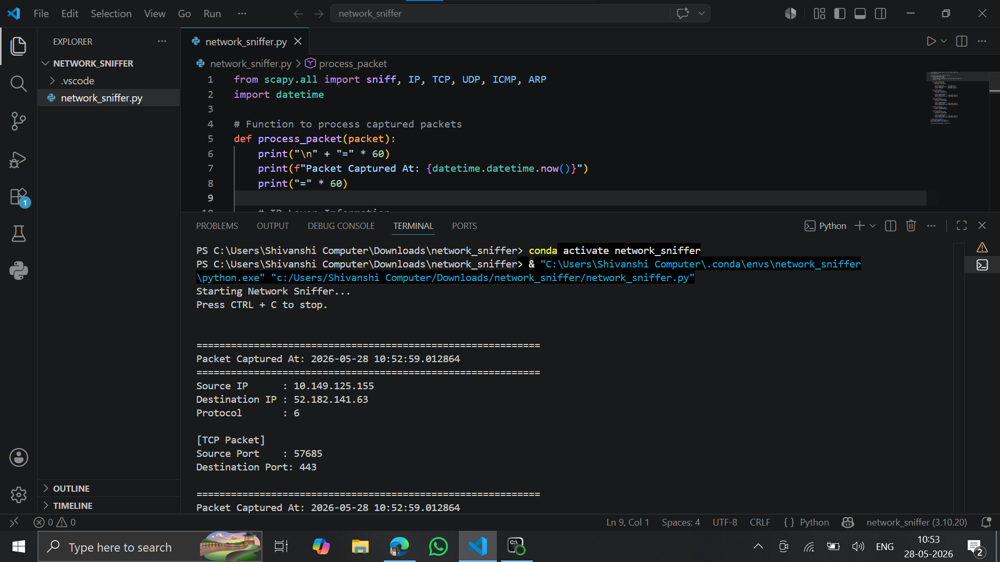
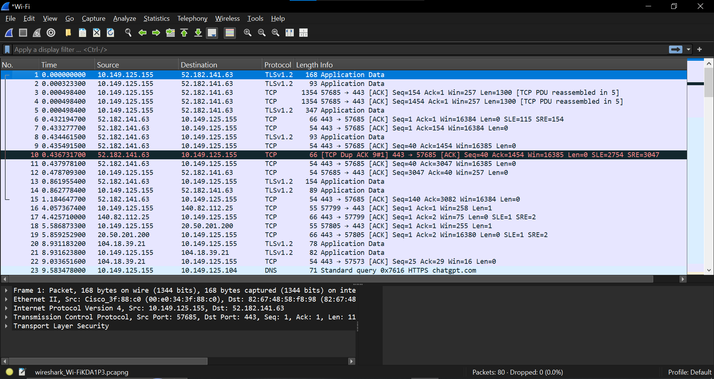

# Basic Network Sniffer

## Overview

This project is a Basic Network Sniffer developed using Python to capture and analyze network packets in real time. It helps in understanding how network communication works and provides practical exposure to packet analysis and cybersecurity concepts.

## Objective

The objective of this project is to monitor network traffic, inspect packet details, and gain hands-on experience with networking and cybersecurity fundamentals.

## Features

* Captures live network packets
* Displays source and destination IP addresses
* Identifies protocols such as TCP, UDP, and ICMP
* Provides real-time packet monitoring
* Helps understand network communication and packet structures

## Technologies Used

* Python
* Socket Programming
* VS Code
* Wireshark
* Npcap

## Screenshots

### VS Code Output

### Wireshark Output

## Learning Outcomes

* Understanding of Network Packet Analysis
* Knowledge of TCP/IP Protocols
* Cybersecurity Fundamentals
* Real-Time Traffic Monitoring
* Python Programming for Network Security

## Author

**Arpita Shikhare**

Cybersecurity Internship – Task 1

