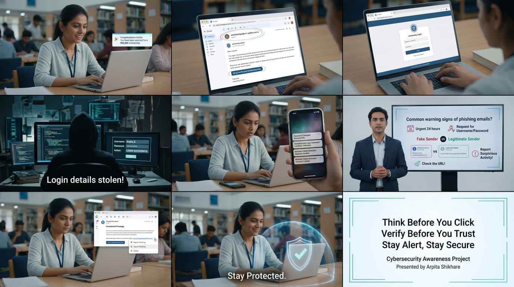

# Phishing Awareness Training

## Overview

This project is a cybersecurity awareness presentation designed to educate users about phishing attacks, fake websites, social engineering tactics, and safe online practices.

## Topics Covered

* What is Phishing?
* Learn to Spot Phishing Emails
* Learn to Spot Fake Websites
* Social Engineering Tactics
* Practices to Stay Safe
* Real-World Examples of Phishing Attacks
* Interactive Quiz

## Presentation Files

* PowerPoint Presentation (.pptx)
* PDF Version (.pdf)

## Author

**Arpita Shikhare**

Cybersecurity Internship – Task 2

